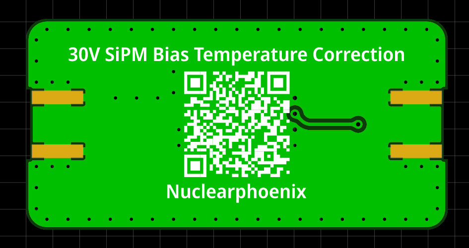

# MicroFC SiPM Temperature Compensation

PCB to temperature compensate the gain of a C-Series MicroFC silicon photomultiplier by [onsemi](https://www.onsemi.com/pdf/datasheet/microc-series-d.pdf). Diesnged as a passthrough for the SiPM bias voltage. You can buy all the parts and the PCB using [Kitspace](https://kitspace.org/opengammaproject/MicroFC-TempCo) (non-affiliated).

PCB size is 20 x 40 mm, which is a lot larger than it needs to be, but it's nicer to use with cables this way and solder everything in place.

  
  

  
  

The temperature compensation circuitry is based on a [paper by Evgeny Kuznetsov](https://doi.org/10.1016/j.nima.2017.11.060) (Temperature-compensated silicon photomultiplier) and aims to roughly support the 21 mv/K slope of the SiPM. Research and testing was at first mostly done by [@sebyon](https://github.com/sebyon), thanks a lot!

However, upon re-testing on a heated 3D printer bed in ranges of 20°C - 50°C it looks more like ~14 mV/K. This might very well be caused by the testing setup. The print bed does not deliver exact temperature values and my multimeter might be off a little bit too. The possibility that different loads affect the slope of the compensation must also be researched in the future. In this testing, there was not load attached except for the multimeter. The whole setup was allowed a 20 minute stablizing period before measuring between each temperature step.

The board features standard SMA edge connectors, which can be used with standard SMA cables to connect between the power supply and the SiPM. Alternatively, you can also solder your own wires to the corresponding pads.

